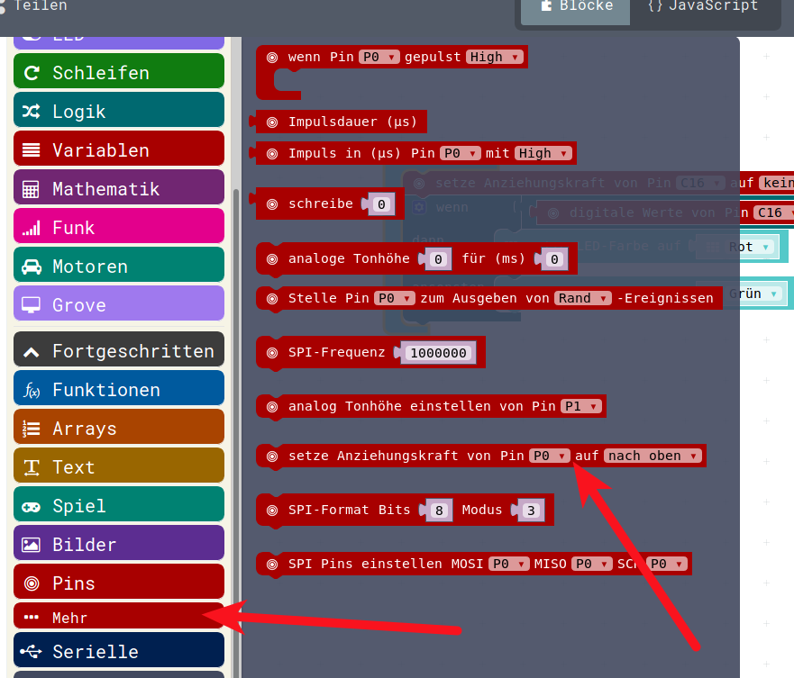
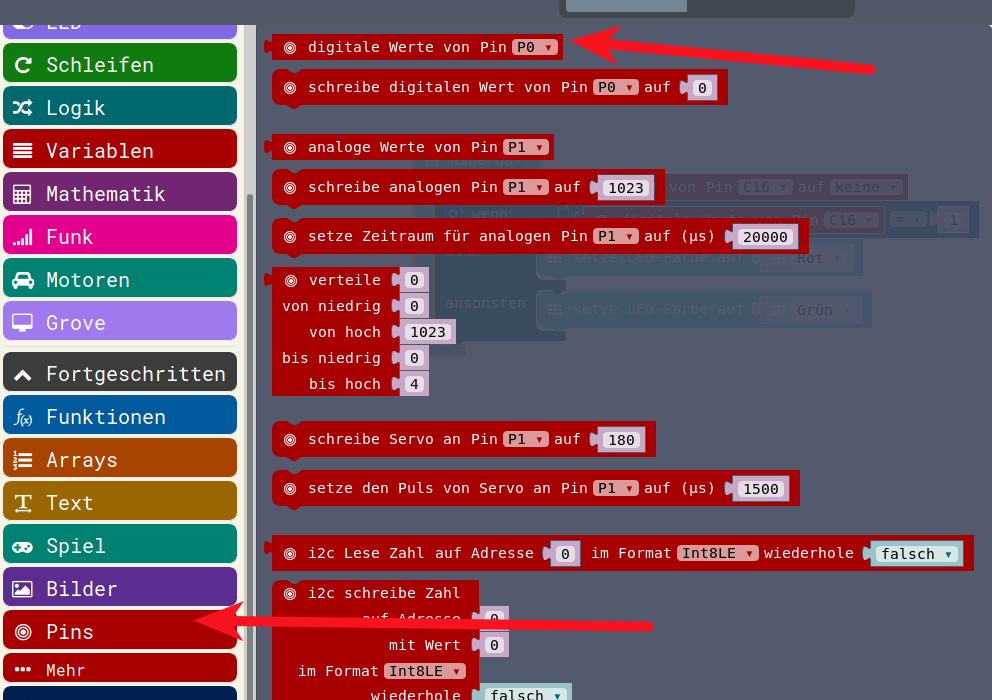
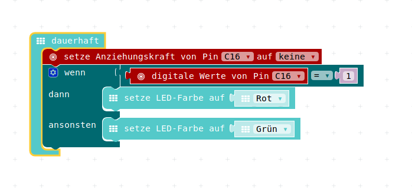

# MINI-PIR 

## PIN-Menu 





 

## Entfernung Frequenz




### Javascript


<details>
 <summary>Java-Script-Code</summary>

```js
basic.forever(() => {
    pins.setPull(DigitalPin.C16, PinPullMode.PullNone)
    if (pins.digitalReadPin(DigitalPin.C16) == 1) {
        basic.setLedColor(Colors.Red)
    } else {
        basic.setLedColor(Colors.Green)
    }
})


```
</details>


### Download Hex-Code

[Hex-code](code/mini-Grove_Mini_Pir01.hex)

