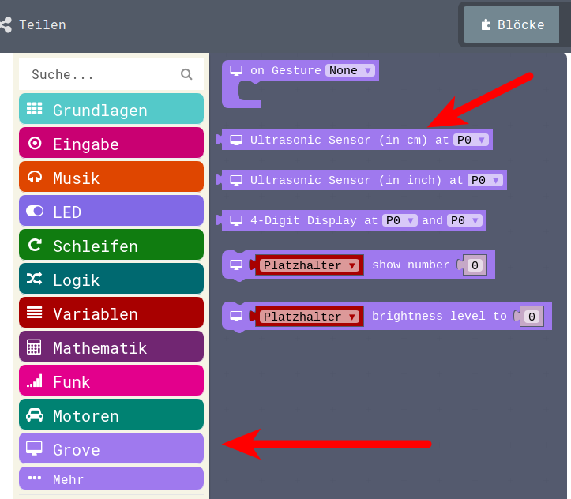
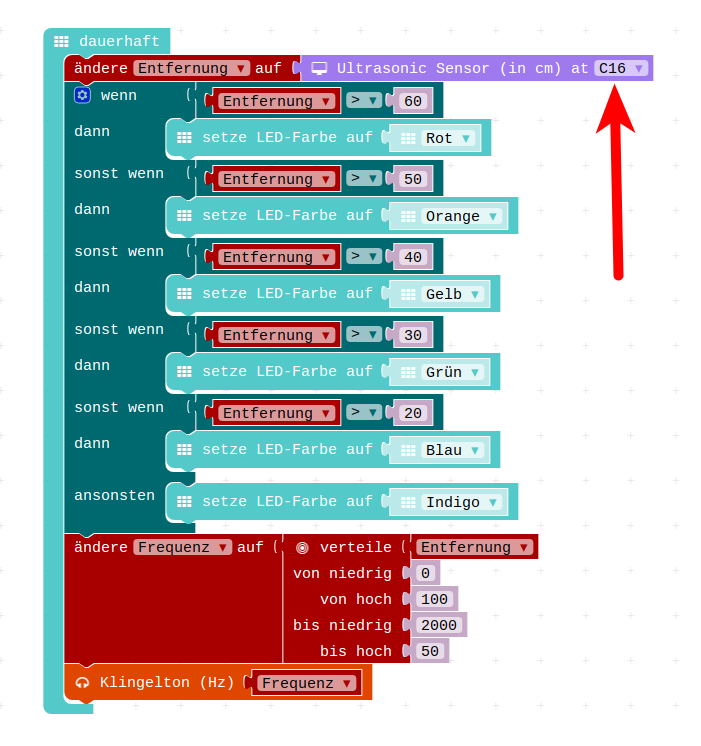

# Ultrasonic

## grove-Menu





## Entfernung Frequenz




### Javascript


<details>
 <summary>Java-Script-Code</summary>

```js
let Frequenz = 0
let Entfernung = 0
basic.forever(() => {
    Entfernung = grove.measureInCentimeters(DigitalPin.C16)
    if (Entfernung > 60) {
        basic.setLedColor(Colors.Red)
    } else if (Entfernung > 50) {
        basic.setLedColor(Colors.Orange)
    } else if (Entfernung > 40) {
        basic.setLedColor(Colors.Yellow)
    } else if (Entfernung > 30) {
        basic.setLedColor(Colors.Green)
    } else if (Entfernung > 20) {
        basic.setLedColor(Colors.Blue)
    } else {
        basic.setLedColor(Colors.Indigo)
    }
    Frequenz = pins.map(
    Entfernung,
    0,
    100,
    2000,
    50
    )
    music.ringTone(Frequenz)
})


```
</details>


### Download Hex-Code

[Hex-code](code/mini-ultrasonic3.hex)

